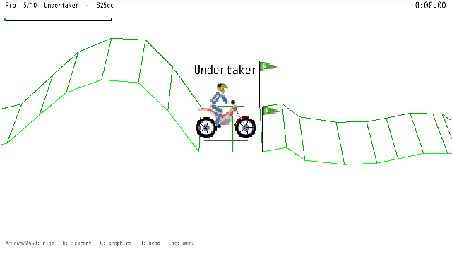

# Gravity Defied on DragonRuby

[](https://halvanhelv.github.io/gravity-defied/)

**[▶ Play in the browser](https://halvanhelv.github.io/gravity-defied/)** · built with [DragonRuby](https://dragonruby.org) · GPL-2.0

An experimental port of the 2004 J2ME motorbike game to DragonRuby GTK, with the original
sprites (or the original line-art mode), the original unlock rules and best times.

Gravity Defied was made by Codebrew Software (2004); the sprites and tracks come from that game.
Based on the community ports [gravity_defied_cpp](https://github.com/rgimad/gravity_defied_cpp)
and [gravity-defied-web](https://github.com/yurkagon/gravity-defied-web). Both are GPL-2.0,
so this port is GPL-2.0 as well.

## Run from source

This repository is the `mygame` folder of a DragonRuby GTK project. Unzip DragonRuby, replace its
`mygame` folder with this repository and run `./dragonruby`.

Publish to GitHub Pages: `tools/deploy_pages.sh` builds the web version and pushes the landing
page (`site/`) to the root and the game to `play/` on the `gh-pages` branch. `--preview` only
assembles the site into a temp folder.

Menu: Up/Down choose a row, Left/Right change it, Enter ride. Locked tracks and bikes show a lock
and what to finish to open them.
Riding: arrows or WASD (up gas, down brake, left/right lean), `R` restart, `G` sprites/lines,
`H` DragonRuby logo head or helmet, `Esc` menu.

Start with the 100cc bike and the first Easy and Medium tracks. Finishing a track opens the next
one; finishing a level's last track opens the next level and a bigger bike. Progress and the
three best times per track and bike live in `__save_data__/progress.txt`.

## Autopilot runs

Press `D` in the menu on a track that has a recorded run and the game rides it by itself, like a
normal ride (nothing is saved). Runs are found offline by beam search over held inputs; the
physics is deterministic, so they replay frame for frame:

```sh
ruby tools/find_demo.rb <level> <track> <bike>   # writes data/demos/<level>_<track>.txt
ruby tools/bundle_demos.rb                       # rebuilds app/demos_data.rb
```

Recorded: Easy "Intro", Medium "Spikehops", Pro "Undertaker", "Intense" and "Dantes Peak" (325cc).

## Layout

| File | What |
|---|---|
| `app/f16.rb` | 16.16 fixed-point math with int32 wrap-around |
| `app/physics.rb` | six point masses joined by springs, collision response |
| `app/track.rb` | track polyline, collision, pseudo-3D geometry |
| `app/renderer.rb` | world to screen: thin lines, sprites, both graphics modes |
| `app/game.rb` | one ride: 30 ms steps, crash/restart timers, finish |
| `app/progress.rb` | unlocks and best times, saved as plain text |
| `app/menu.rb`, `app/hud.rb`, `app/ui.rb` | start screen, in-ride overlay, drawing helpers |
| `app/app.rb` | switches between menu, ride and autopilot playback |
| `app/demo.rb`, `app/demos_data.rb` | autopilot playback and the bundled recorded runs |
| `site/` | landing page (HTML, CSS, gameplay video); `tools/deploy_pages.sh` publishes it |
| `app/levels_data.rb` | generated from `data/levels.mrg` by `tools/convert_levels.rb` |

## Tests

```sh
ruby test/run.rb
```

Physics is checked bit-exactly against traces recorded from the TypeScript port; the rest covers
fixed-point math, unlock rules and the menu/ride flow through fake inputs.

## Differences from the original

- The original physics can loop forever when a sub-step halves to zero (e.g. Pro "Liberty" on
  325cc); here the rider crashes instead.
- DragonRuby quirks: `Integer#/` returns a Float, so integer math goes through `F16.idiv`;
  pure black primitives do not show up, so black is drawn as (1, 1, 1).
- No player names in the records table.
